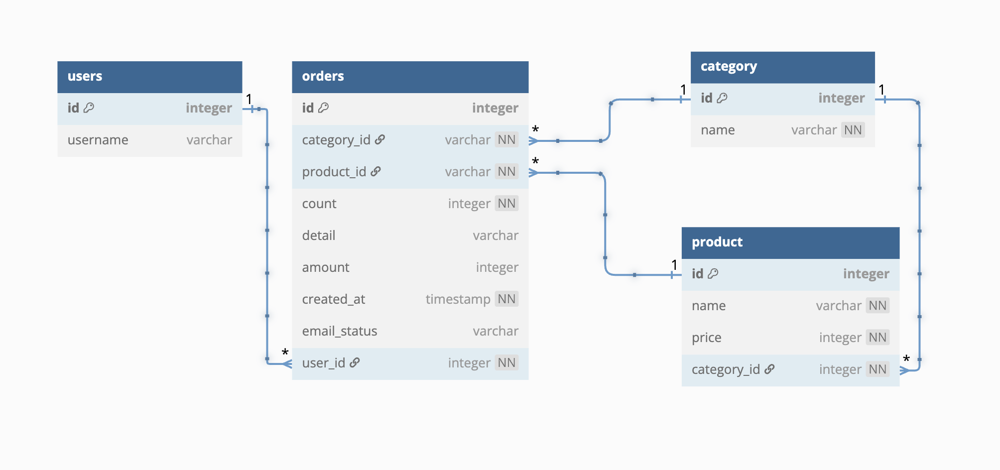

# 📦발주 예약 시스템

특정 상품에 대한 주문 내역을 대상 이메일에게 전달하는 발주 예약 시스템입니다.

발주의 대상 상품에 대한 수량, 품목, 세부사항을 특정 이메일로 전송할 수 있습니다.

### 사용자 기능 분석

- [x] 사용자는 상품의 발주를 예약할 수 있다.
  - [x] 상품은 카테고리, 품목, 수량 그리고 세부사항를 필수로 입력
- [ ] 사용자는 자신의 발주 내역을 확인할 수 있다.
  - [ ] 상품의 정보, 최근 업데이트 시간, 이메일 전송 상태 출력
  - [ ] 수정, 삭제 이후에도 발주 내역을 확인 가능
- [ ] 사용자는 자신의 발주 내역을 수정할 수 있다.
  - [ ] 수정 후에는 최근 업데이트 시간을 갱신 후, 이메일 재전송
- [ ] 사용자는 자신의 발주 내역을 삭제할 수 있다.
  - [ ] 삭제 후에는 최근 업데이트 시간을 갱신 후, 이메일 재전송
- [ ] 현재의 기능에서는 `이메일 전송 완료` 상태만 사용자에게 보여진다.

### Database ERD

